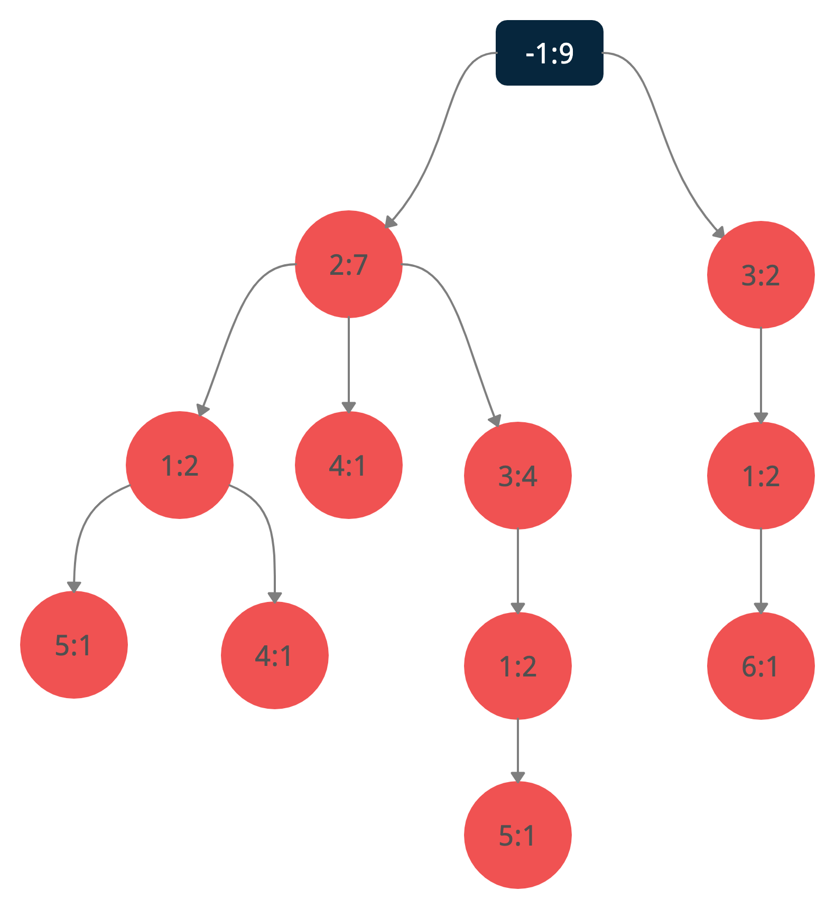

# FP-Tree
Frequency Pattern Tree

  

<pre>
T1 {5,1,2} 
T2 {4,2} 
T3 {3,2} 
T4 {4,1,2} 
T5 {1,3} 
T6 {3,2} 
T7 {6,1,3} 
T8 {5,1,3,2} 
T9 {1,3,2} 
Creating Node 2
Creating Node 1
Creating Node 5

Proceeding Node 2
Creating Node 4

Proceeding Node 2
Creating Node 3

Proceeding Node 2
Proceeding Node 1
Creating Node 4

Creating NULL Node 3
Creating Node 1

Proceeding Node 2
Proceeding Node 3

Proceeding Node 3
Proceeding Node 1
Creating Node 6

Proceeding Node 2
Proceeding Node 3
Creating Node 1
Creating Node 5

Proceeding Node 2
Proceeding Node 3
Proceeding Node 1

( -1 , 9): (2 ,7), (3 ,2), 
( 2 , 7): (1 ,2), (3 ,4), (4 ,1), 
( 1 , 2): (4 ,1), (5 ,1), 
( 4 , 1): 
( 5 , 1): 
( 3 , 4): (1 ,2), 
( 1 , 2): (5 ,1), 
( 5 , 1): 
( 4 , 1): 
( 3 , 2): (1 ,2), 
( 1 , 2): (6 ,1), 
( 6 , 1): 
</pre>
